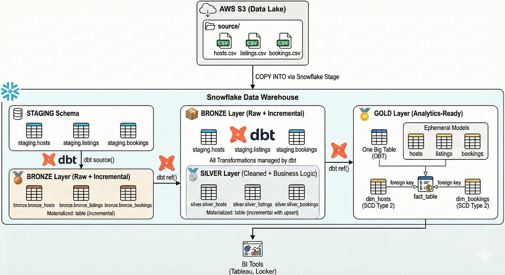
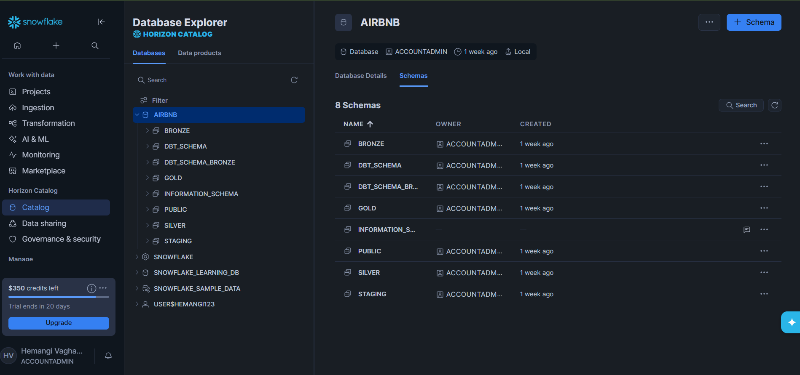

# 🚀 Airbnb Data Engineering Pipeline


---

# 📌 Project Overview

A **modern end-to-end data engineering pipeline** using AWS, Snowflake, DBT, Airflow, and Docker.

This project transforms raw Airbnb data into **analytics-ready datasets** using the **Medallion Architecture (Bronze → Silver → Gold)** and visualizes insights in **Power BI**.

---

# 🔥 Project Highlights

✔ End-to-End Pipeline (S3 → Snowflake → DBT → Airflow → Power BI)
✔ Medallion Architecture (Bronze, Silver, Gold)
✔ SCD Type 2 using DBT Snapshots
✔ Star Schema for analytics
✔ Automated Airflow DAG pipeline
✔ Dockerized environment
✔ Interactive Power BI dashboards

---

# 📊 Architecture



---

# ⚙️ Tech Stack

| Tool      | Purpose          |
| --------- | ---------------- |
| AWS S3    | Raw data storage |
| Snowflake | Data warehouse   |
| DBT       | Transformation   |
| Airflow   | Orchestration    |
| Docker    | Containerization |
| Python    | DAG development  |

---

# 📂 Dataset

* Bookings
* Listings
* Hosts

---

# 🚀 Pipeline Workflow

```
S3 → Snowflake → DBT (Bronze → Silver → Gold) → Airflow → Power BI
```

---

# 🧊 Snowflake Data Warehouse



✔ Data loaded from S3 using COPY INTO
✔ Staging + Transformation layers

---

# 🔄 DBT Lineage


✔ End-to-end transformation flow
✔ Model dependencies

---

# 🧱 Data Modeling (Star Schema)


✔ Fact + Dimension tables
✔ Optimized for BI

---

# 📈 Power BI Dashboard

## 💰 Revenue Dashboard


## 👤 Host Dashboard


---

# 🔄 Airflow DAG


✔ Automated pipeline
✔ Task dependencies

---

# 🐳 Docker Setup

```
airflow-apiserver
airflow-scheduler
airflow-worker
postgres
redis
```

---

# ▶️ Run Project

```
git clone <your-repo-link>
docker compose up airflow-init
docker compose up -d
```

---

# 📌 DBT Commands

```
dbt run --select bronze
dbt run --select silver
dbt snapshot
dbt run --select gold
dbt test
```

---

# 📌 Future Improvements

* Data Quality Checks
* CI/CD Pipeline
* Monitoring & Alerts
* Real-time processing

---

# 👨‍💻 Author

**Hemangi Vaghasiya**
Aspiring Data Engineer

```
Python | SQL | Snowflake | DBT | Airflow | AWS | Docker
```

---
